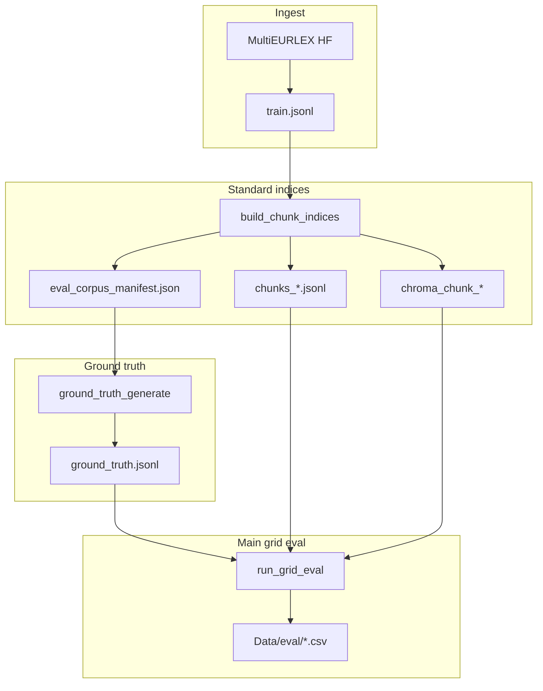

# TFM project guide — structure, scripts, and data

This document complements the [quick-start README](../README.md) with an **accurate map** of the repository: what each major path is for, how evaluation tracks differ, and how modules depend on each other.

---

## 1. What this project does

- **Ingest** English MultiEURLEX rows into `Data/train.jsonl` (configurable document cap).
- **Preprocess** EUROVOC labels using `Data/categories.json`.
- **Chunk** each document under **10 chunking strategies**, embed with **Ollama**, and store **one Chroma DB per strategy**.
- **Evaluate retrieval** with dense, BM25, and hybrid retrievers; optional **cross-encoder rerank** (`*_ce_r50` variants).
- **Generate evaluation questions** with an LLM (ground-truth JSONL).
- **Extended tracks**: top-10 curated grid (k=20), **dedup** subset of the corpus with its own indices and ground truth, **Ragas** judging of RAG answers, and optional smaller **top-5** grid runs.

---

## 2. Documentation map

| Doc | Role |
|-----|------|
| [README.md](../README.md) | Ordered commands (Steps 0–5), prerequisites, troubleshooting, env vars, Ragas snippet. |
| **This file** | Project tree, every script’s purpose, data artifacts, parallel eval tracks. |

---

## 3. High-level data flow

**Dedup track** (parallel): `train_dedup.jsonl` → filter/copy from standard chunk+Chroma (`build_chunk_indices_dedup`) → `chunks_dedup_*`, `chroma_chunk_dedup_*`, `eval_corpus_manifest_dedup.json` → `ground_truth_generate_dedup` → evals under `Data/eval_top10_dedup/`.

---

## 4. Evaluation tracks (which script, which k, which GT)

Use this table to avoid confusing the **main grid** (final list length **10**) with **top-10 experiments** (final list **20**).

| Track | Ground truth | Retrieval / notes | Main entry points |
|-------|----------------|-------------------|-------------------|
| **Main grid** | `Data/ground_truth.jsonl` | `FINAL_K = 10`; `RETRIEVAL_CANDIDATE_K` pool (default 50) for `*_ce_r50` | `build_chunk_indices`, `ground_truth_generate`, `run_grid_eval` |
| **Top-10 evals 1–4** (standard corpus) | Default `ground_truth.jsonl` | k=**20**, candidate breadth 100; **10** hand-picked `(chunk, retriever)` pairs | `top10/run_eval1_baseline` … `run_eval4_multiquery`, `top10/run_all` |
| **Top-10 dedup** | `Data/ground_truth_dedup_top10_100.jsonl` | Same pair set / k=20 on **dedup** chunks+Chroma | `build_chunk_indices_dedup`, `ground_truth_generate_dedup`, `run_eval*_dedup`, `run_dedup_top10_evals.sh` |
| **Top-5 grid** | `ground_truth_top5_1000.jsonl` (default) | Subset of hybrids on `len_1000_o100` only via `run_grid` | `run_top5_eval.py`, `ground_truth_generate_top5.py` |
| **Ragas LLM triad** | Dedup GT (default paths in script) | Replay best cell + generate answers + Ragas scores | `llm_triad/generate_rag_responses`, `llm_triad/judge_rag_triad` |

Pair definitions for top-10-style evals live in [`Scripts/eval/top10/pairs.py`](../Scripts/eval/top10/pairs.py) (`SELECTED_PAIRS_EVAL1`).

---

## 5. Repository layout (root)

| Path | Purpose |
|------|---------|
| `README.md` | User-facing pipeline steps and troubleshooting. |
| `requirements.txt` | Python dependencies; **Ragas pinned** (`ragas==0.4.3`). |
| `run_main.py` | Thin wrapper: runs `Scripts.main:main` from repo root. |
| `run_api.py` | Thin wrapper: starts `Scripts.api`. |
| `Scripts/` | All application code (modules run as `python -m Scripts….`). |
| `Data/` | Dataset, indices, manifests, ground truth, eval outputs (many paths gitignored — see README). |
| `docs/` | Deep documentation (this guide). |

---

## 6. `Data/` artifacts (conceptual checklist)

Artifacts depend on which track you ran. Common ones:

### Standard corpus

| Path | Produced by |
|------|-------------|
| `train.jsonl` | `data_extraction_load` |
| `categories.json` | Typically shipped with repo |
| `eval_corpus_manifest.json` | `build_chunk_indices` |
| `chunks_<strategy>.jsonl` | `build_chunk_indices` |
| `chroma_chunk_<strategy>/` | `build_chunk_indices` |
| `ground_truth.jsonl` | `ground_truth_generate` |
| `eval/*.csv`, `eval/eval_grid_checkpoint.json` | `run_grid_eval` |

### Dedup corpus (`dedup_paths`)

| Path | Role |
|------|------|
| `train_dedup.jsonl` | Filtered English corpus for dedup experiments (must exist before dedup indexing). |
| `eval_corpus_manifest_dedup.json` | CELEX scope for dedup GT and evals. |
| `chunks_dedup_<strategy>.jsonl` | Subset lines from `chunks_<strategy>.jsonl` for CELEX ∈ dedup train. |
| `chroma_chunk_dedup_<strategy>/` | Chroma filtered to dedup CELEX IDs. |
| `ground_truth_dedup_top10_100.jsonl` | LLM QA pairs aligned to dedup corpus + validation. |
| `neighbor_index_dedup/<strategy>.pkl` | Chunk order/neighbors for dedup eval2. |
| `eval_top10_dedup/` | Outputs for `run_eval1_baseline_dedup`, `run_eval2_neighbors_dedup`, prefetch bundles, merged CSVs. |

### Top-10 standard (non-dedup)

| Path | Role |
|------|------|
| `eval_top10/eval*_*/` | Per-eval checkpoints and CSVs. |
| `eval_top10/prefetch/` | Two-phase prefetch JSON (embedding stage vs rerank-only stage). |
| `neighbor_index/<strategy>.pkl` | Neighbor expansion for eval2 (standard corpus). |
| `enhanced_questions/`, `multi_query_questions/` | Persisted LLM rewrites / multi-query variants (eval3/4). |

### Ragas (`llm_triad` defaults under `eval_top10_dedup/`)

Typical filenames: `rag_responses.jsonl`, `rag_responses.jsonl.meta.json`, `ragas_scores.jsonl`, `*_summary.csv`, `*_summary_stats.json`.

---

## 7. `Scripts/` — package overview

`Scripts` is a **Python package**. Run modules from the repo root via `python -m Scripts.<module>`. `config.PROJECT_ROOT` points at the repo root (parent of `Scripts/`).

### 7.1 Core pipeline (non-eval)

| File | Purpose |
|------|---------|
| [`config.py`](../Scripts/config.py) | Central paths (`DATA_DIR`), `DOC_LIMIT`, Ollama model names, `RETRIEVAL_CANDIDATE_K`, rerank env defaults, system prompt text. |
| [`data_extraction_load.py`](../Scripts/data_extraction_load.py) | Download / extract MultiEURLEX; writes `train.jsonl` (+ metadata). Uses `HF_TOKEN`. |
| [`preprocess.py`](../Scripts/preprocess.py) | `preprocess_for_rag`: merges EuroVOC labels from `categories.json`. |
| [`chunking_strategies.py`](../Scripts/chunking_strategies.py) | IDs for the **10** strategies, persistence path helpers (`chroma_persist_dir`). |
| [`chunking.py`](../Scripts/chunking.py) | Legacy / dev single-strategy chunking (`CHUNKS_JSONL`). |
| [`embeddings_chromadb.py`](../Scripts/embeddings_chromadb.py) | Ollama embeddings batching, Chroma ingest, vectorstore load/cache release. |
| [`retriever.py`](../Scripts/retriever.py) | `rag_answer`, `_build_rag_prompt`: invoke LLM over retrieved LangChain documents. |
| [`main.py`](../Scripts/main.py) | CLI demo: load Chroma slice, retrieve, answer. |
| [`api.py`](../Scripts/api.py) | FastAPI app (`API_HOST`/`API_PORT`). |

### 7.2 `Scripts/eval/` — shared eval infrastructure

| File | Purpose |
|------|---------|
| [`metrics.py`](../Scripts/eval/metrics.py) | Text normalize, `first_hit_rank`, `aggregate_ranks`, `aggregate_ranks_topk` (supports k greater than 10). |
| [`retrieval_strategies.py`](../Scripts/eval/retrieval_strategies.py) | **FINAL_K=10**, 10 base retriever implementations + rerank wrappers; BM25 corpus binding; `RetrievalContext`. |
| [`rerank_cross_encoder.py`](../Scripts/eval/rerank_cross_encoder.py) | Load `RERANK_MODEL`, score pairs, reorder docs, optional unload/load hooks. |
| [`build_chunk_indices.py`](../Scripts/eval/build_chunk_indices.py) | Build **all 10** (or subset) chunk JSONLs + Chroma + `eval_corpus_manifest.json`; resume-aware. |
| [`build_chunk_indices_dedup.py`](../Scripts/eval/build_chunk_indices_dedup.py) | Streams standard `chunks_*.jsonl` → `chunks_dedup_*`, copies/prunes Chroma to `chroma_chunk_dedup_*`; `--top10` limits strategies to those in curated pairs; writes `eval_corpus_manifest_dedup.json`. **No new Ollama embed calls** (reuse vectors). |
| [`ground_truth_generate.py`](../Scripts/eval/ground_truth_generate.py) | Samples snippets from manifest-visible docs; LLM emits questions → `ground_truth.jsonl`. |
| [`ground_truth_generate_dedup.py`](../Scripts/eval/ground_truth_generate_dedup.py) | Same idea on dedup corpus; enforces snippet-in-middle-chunk across strategies in pairs; richer JSON schema (`answer`, validations). |
| [`ground_truth_generate_top5.py`](../Scripts/eval/ground_truth_generate_top5.py) | Ground truth for narrow top-5 grid experiment. |
| [`run_grid_eval.py`](../Scripts/eval/run_grid_eval.py) | Full ×× grid driver: checkpoint after each GT row, summaries + long breakdown CSVs when complete. |
| [`run_top5_eval.py`](../Scripts/eval/run_top5_eval.py) | Convenience wrapper calling `run_grid` with fixed top-5 retriever list & strategy. |
| [`merge_top10_summaries.py`](../Scripts/eval/merge_top10_summaries.py) | Merge CSVs across standard top-10 eval dirs. |
| [`merge_top10_summaries_dedup.py`](../Scripts/eval/merge_top10_summaries_dedup.py) | Merge `eval_top10_dedup/eval1_baseline` + `eval2_neighbors` summaries. |
| [`run_dedup_top10_evals.sh`](../Scripts/eval/run_dedup_top10_evals.sh) | Bash orchestration: conda-aware Python, prefetch-write/read for dedup eval1+2, teardown between GPU-heavy phases; optional `--reset`. |

### 7.3 `Scripts/eval/top10/` — k=20 experiments

| File | Purpose |
|------|---------|
| [`pairs.py`](../Scripts/eval/top10/pairs.py) | `SELECTED_PAIRS_EVAL1`; fingerprint hashing; rerank naming for eval2–4. |
| [`dedup_paths.py`](../Scripts/eval/top10/dedup_paths.py) | Canonical dedup filesystem paths (`DEDUP_GROUND_TRUTH`, `*_dedup_*` dirs). |
| [`_shared.py`](../Scripts/eval/top10/_shared.py) | Load GT, fingerprint chunk+retriever cells, atomic JSON helpers, SHA256 of files. |
| [`prefetch_io.py`](../Scripts/eval/top10/prefetch_io.py) | Serialize candidate lists to/from JSON prefetch bundles. |
| [`retrieval_k20.py`](../Scripts/eval/top10/retrieval_k20.py) | `run_retriever_k`/`finalize_from_candidates` with **final_k=20**. |
| [`_engine.py`](../Scripts/eval/top10/_engine.py) | Standard top-10 eval loop orchestration + GPU hygiene. |
| [`_engine_dedup.py`](../Scripts/eval/top10/_engine_dedup.py) | Dedup paths + checkpoints for `_dedup` eval modules. |
| [`_results.py`](../Scripts/eval/top10/_results.py) | Write `results_summary`, pivot, breakdown CSVs from rank lists. |
| [`run_eval1_baseline.py`](../Scripts/eval/top10/run_eval1_baseline.py) | Eval 1 baseline (standard corpus). |
| [`run_eval1_baseline_dedup.py`](../Scripts/eval/top10/run_eval1_baseline_dedup.py) | Eval 1 on dedup Chroma chunks. |
| [`run_eval2_neighbors.py`](../Scripts/eval/top10/run_eval2_neighbors.py) | Neighbor-augmented retrieval (standard). |
| [`run_eval2_neighbors_dedup.py`](../Scripts/eval/top10/run_eval2_neighbors_dedup.py) | Dedup counterpart. |
| [`neighbor_index.py`](../Scripts/eval/top10/neighbor_index.py) | Build/load neighbor maps from `chunks_*.jsonl`. |
| [`neighbor_index_dedup.py`](../Scripts/eval/top10/neighbor_index_dedup.py) | Same for `chunks_dedup_*.jsonl`; `--top10` builds only strategies in pairs. |
| [`chunk_stats.py`](../Scripts/eval/top10/chunk_stats.py) | Corpus-wide chunk statistics for prompts (eval3/4). |
| [`question_enhance.py`](../Scripts/eval/top10/question_enhance.py) | LLM-enhanced wording utilities. |
| [`materialize_llm_inputs.py`](../Scripts/eval/top10/materialize_llm_inputs.py) | Precompute enhanced / multi-query JSONL without retrieval. |
| [`run_eval3_enhanced.py`](../Scripts/eval/top10/run_eval3_enhanced.py) | Eval 3: retrieve with enhanced questions. |
| [`run_eval4_multiquery.py`](../Scripts/eval/top10/run_eval4_multiquery.py) | Eval 4: union retrieval from multiple queries. |
| [`run_all.py`](../Scripts/eval/top10/run_all.py) | Run eval drivers in sequence (+ optional prefetch phases). |
| [`dedup_eval_state.py`](../Scripts/eval/top10/dedup_eval_state.py) | Inspect dedup prefetch/eval completion for shell driver. |
| [`dedup_gpu_teardown.py`](../Scripts/eval/top10/dedup_gpu_teardown.py) | Release Chroma cache, unload CE, optional `ollama stop` on embed model. |

### 7.4 `Scripts/eval/llm_triad/` — Ragas

| File | Purpose |
|------|---------|
| [`generate_rag_responses.py`](../Scripts/eval/llm_triad/generate_rag_responses.py) | Replay retriever (+prefetch); constrained RAG via `SYSTEM_PROMPT`; emits `rag_responses_v2` JSONL (`ground_truth_answer`, `reference_contexts`). |
| [`judge_rag_triad.py`](../Scripts/eval/llm_triad/judge_rag_triad.py) | `ragas.evaluate` with **`full`** (default) or **`minimal`** metrics; optional `--ground-truth` merge for legacy artifacts; skips rows without contexts; emits scores JSONL + CSV + `*_summary_stats.json`. |

---

## 8. Dedup workflow (recommended order)

1. Complete **standard** `build_chunk_indices` for all strategies referenced by curated pairs (dedup indexing **reads** existing `chunks_*.jsonl` + chroma dirs).
2. Ensure `Data/train_dedup.jsonl` exists (project-specific curated subset).
3. `python -m Scripts.eval.build_chunk_indices_dedup --top10`
4. `python -m Scripts.eval.ground_truth_generate_dedup` (writes `ground_truth_dedup_top10_100.jsonl`).
5. `python -m Scripts.eval.top10.neighbor_index_dedup --top10`
6. Run evals manually or **`bash Scripts/eval/run_dedup_top10_evals.sh`** (handles prefetch-write/read splitting and GPU teardown).
7. `python -m Scripts.eval.merge_top10_summaries_dedup`

---

## 9. Configuration and environment (summary)

Detailed tables stay in README. Mental model:

- **Ollama**: embedding + chat model names live in **`Scripts/config.py`**.
- **Rerank**: `RERANK_MODEL`, `RERANK_DEVICE`, `RERANK_PREDICT_BATCH_SIZE`, `RETRIEVAL_CANDIDATE_K`, `RERANK_PASSAGE_MAX_CHARS`.
- **Dedup shell driver**: `DEDUP_EVAL_OLLAMA_STOP`, `DEDUP_EVAL_RESET`, `DEDUP_CONDA_ENV`, `DEDUP_NO_CONDA`.

---

## 10. Keeping this guide accurate

When you add scripts or rename data paths:

1. Update **this guide** (`docs/PROJECT_GUIDE.md`).
2. Update **README** for any change to numbered steps, defaults, or user-visible commands.

If README and this guide disagree after an edit, treat **executable module docstrings and `config.py`** as authoritative for behavior, then fix the prose.
